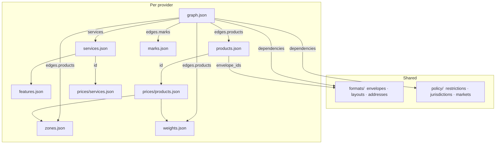

# Porto Data

[](https://github.com/gruncellka/porto-data/actions/workflows/validation.yml)
[](https://codecov.io/gh/gruncellka/porto-data)

**Porto Data** is **JSON + schemas** for national postal operators under one shared layout and vocabulary. Published on **npm** and **PyPI** with the **same** `porto_data/` tree on every platform.

Supported providers: **Deutsche Post**, **Ukrposhta**, **La Poste**, **Swiss Post**. Per-provider notes: [docs/providers/](docs/providers/).

Shared **[policy](docs/policy.md)** and **[formats](docs/formats.md)** live at the bundle root; each provider’s catalog lives under **`providers/<id>/`** (products, services, prices, zones, weights, features, **`graph.json`**).

---

## Install

```bash
npm install @gruncellka/porto-data
# or
pip install gruncellka-porto-data
```

Both packages ship UTF-8 JSON + schemas only (no native code): `porto_data/policy/`, `porto_data/formats/`, `porto_data/providers/<id>/`, `porto_data/schemas/`, plus `mappings.json` and `metadata.json`.

---

## Example

A provider catalog is **linked** JSON: the same product [`id`](docs/id.md) appears in the product row, the price grid, and `graph.json`.

Deutsche Post — abbreviated from live catalog files:

**`products.json`**

```json
{
  "id": "standardbrief",
  "name": "Standardbrief",
  "label": "Standard Letter",
  "envelope_ids": ["DL", "C6"]
}
```

**`prices/products.json`**

```json
{
  "product_id": "standardbrief",
  "zone": "domestic",
  "weight_tier": "W0020",
  "price": [
    {
      "amount": 95,
      "effective_from": "2026-01-01",
      "effective_to": null
    }
  ]
}
```

**`graph.json`** (`edges.products`)

```json
{
  "standardbrief": {
    "zones": ["domestic", "zone_1_eu", "zone_2_europe", "world"],
    "weight_tiers": ["W0020"]
  }
}
```

Add-ons follow the same pattern: `services.json` rows (`id`, [`kind`](docs/kinds.md), …) are priced in `prices/services.json` and listed on the graph.

---

## Catalog graph

Shared `policy/` and `formats/` at the bundle root; everything else is per provider. Joins are catalog **`id`** ([docs/resolution.md](docs/resolution.md)). Franking size and placement: [docs/marks.md](docs/marks.md). All JSON validates against **`schemas/`**.



---

## Use cases

E-commerce and logistics (multi-carrier quotes, letters), research and education.

---

## Standards

- **Country / region / dates:** ISO 3166-1 alpha-2, ISO 3166-2, ISO 8601.
- **Policy:** global `policy/` destination restrictions, jurisdictions, and markets.
- **Currency / VAT:** per-country defaults in `policy/markets.json` ([docs/resolution.md](docs/resolution.md) § Currency and VAT).

---

## Disclaimer

**Reference data only.** Confirm pricing, restrictions, and availability with the **carrier** you use before shipping. Not a substitute for official systems or legal advice.

---

🔳 gruncellka
