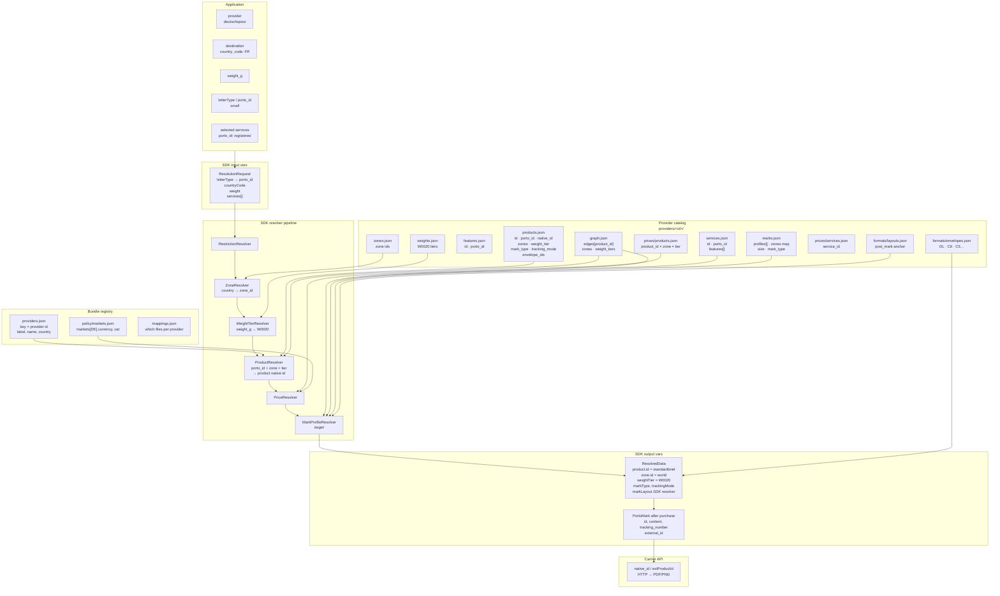

# Identity map — names, ids, variables, relations

One-page map of **who names what** across **porto-data** (JSON + schemas), **Porto SDK** (separate product), and **carrier APIs**.

**porto-data** ships facts and validates them. **Porto SDK** loads the bundle and resolves. This repo has no resolver implementation.

**See also:** [id.md](id.md) · [mark-profiles.md](mark-profiles.md) · [resolution.md](resolution.md) · [SDK_ARCHITECTURE.md](../../docs/sdks/SDK_ARCHITECTURE.md)

---

## Layer stack

```text
┌─────────────────────────────────────────────────────────────────────────────┐
│  APPLICATION                                                                 │
│  vars: provider, destination country, weight_g, letterType, service picks   │
└───────────────────────────────────┬─────────────────────────────────────────┘
                                    │
┌───────────────────────────────────▼─────────────────────────────────────────┐
│  PORTO SDK (Python / TypeScript)                                             │
│  input:  porto_id, country_code, weight, service porto_ids                  │
│  output: ResolvedData (+ PortoMark after adapter call)                       │
└───────────────────────────────────┬─────────────────────────────────────────┘
                                    │ reads bundle only via loader/resolvers
┌───────────────────────────────────▼─────────────────────────────────────────┐
│  PORTO-DATA (this repo — published JSON + schemas)                            │
│  providers/<id>/…  policy/…  formats/…  schemas/…  validators (repo only)   │
└───────────────────────────────────┬─────────────────────────────────────────┘
                                    │ adapters only
┌───────────────────────────────────▼─────────────────────────────────────────┐
│  CARRIER APIs (Internetmarke, MTEL, WebStamp, Ukrposhta eCom, …)             │
│  native product codes, PDF/PNG bytes, tracking numbers                       │
└─────────────────────────────────────────────────────────────────────────────┘
```

---

## Master diagram (ids + files + flow)



---

## Identifier cheat sheet

| Name | Owner | Example | Used in | Never used in |
|------|-------|---------|---------|---------------|
| **`provider`** | Porto registry | `deutschepost` | SDK context, folder path | graph price keys |
| **`label` / `name`** | Display / legal | `"Deutsche Post"`, `"Deutsche Post AG"` | UI, docs | resolution |
| **`country`** | Registry → markets | `DE`, `FR`, `UA`, `CH` | VAT, currency, layouts | product id |
| **`porto_id`** (product) | Porto enum | `small`, `extra_large`, `registered`* | **SDK input** | graph, prices |
| **`porto_id`** (service) | Porto enum | `registered`, `insurance` | **SDK input** | graph.services list |
| **`porto_id`** (feature) | Porto enum | `tracking_number` | semantics | prices |
| **`id`** (product/service) | Provider native | `standardbrief`, `einschreiben` | **graph, prices, rules** | SDK input |
| **`native_id`** | Carrier catalog | `10001` (DE) | **adapter API only** | graph |
| **`zone`** | Provider | `domestic`, `world`, `zone_1_eu` | prices, graph edges | porto_id |
| **`weight_tier`** | Provider | `W0020`, `W1000` | prices, graph edges | porto_id |
| **`mark_profile`** | Porto convention | `domestic`, `registered_international` | **layout output** | porto_id |
| **`mark_type`** | Porto enum | `stamp`, `label` | product + marks profile | — |
| **`tracking_mode`** | Porto enum | `none`, `optional`, `included` | product row | — |
| **`envelope_id`** | Shared formats | `DL`, `C6`, `C4` | products, layouts | — |
| **`PortoMark.id`** | SDK runtime | `deutschepost:abc-123` | execution result | porto-data |
| **`features[].id`** | Provider | `tracking_number` row | services link | cross-provider |

\* `registered` as **product** `porto_id` (La Poste R1/R2/R3 SKUs) vs **service** `porto_id` (Einschreiben add-on) — same word, different rows.

---

## Same word, different layer (common traps)

```text
"registered"
  ├─ porto_id on SERVICE row     → user wants Einschreiben add-on     (SDK input)
  ├─ porto_id on PRODUCT row     → La Poste recommandée SKU          (SDK input)
  └─ mark_profile: "registered"  → domestic registered STAMP size    (layout output)

"domestic"
  ├─ zone id                     → destination lane in prices/graph
  └─ mark_profile id             → stamp footprint variant in marks.json

"id"
  ├─ products.id / services.id   → provider-native (standardbrief)
  ├─ marks.profiles[].id         → mark_profile (domestic)
  └─ PortoMark.id                → runtime execution handle
```

---

## File → key relations

```text
providers.json
  providers[deutschepost].country ──► policy/markets.json markets[DE]

products.json
  id ─────────────────────────────► graph.edges[id]
  id ─────────────────────────────► prices/products.json product_id
  porto_id ◄────────────────────── SDK letterType / porto_id input
  native_id ──────────────────────► adapter API (when present)
  zones[] ────────────────────────► zones.json (subset)
  weight_tier ────────────────────► weights.json
  envelope_ids[] ─────────────────► formats/envelopes.json
  mark_type ──────────────────────► marks.profiles[].mark_type (must match)

graph.json
  edges[product_id].zones[] ──────► zones used for that product
  edges[product_id].weight_tiers[] ► tiers allowed
  services[] (native service ids) ► services.json id list

services.json
  id ─────────────────────────────► prices/services.json service_id
  id ─────────────────────────────► graph.services[]
  porto_id ◄────────────────────── SDK service input (registered → layout upgrade in SDK)
  features[] ─────────────────────► features.json

marks.json
  marks.zones[zone] ────────────────► lane profile id (SDK step 1)
  profiles[].id = mark_profile
  profiles[].size ────────────────► SDK markLayout widthMm / heightMm
  default_profile ────────────────► fallback when marks.zones omits a key

formats/layouts.json
  jurisdictions[DE].post_mark ────► envelope anchor (mm), not stamp size
```

---

## Resolution sequence (variable flow)

```text
INPUT                          RESOLVE TO NATIVE              OUTPUT FIELD
─────                          ─────────────────              ────────────
provider: deutschepost    →    (loader scope)
country_code: US          →    zone: world
weight_g: 20              →    weight_tier: W0020
letterType: small         →    porto_id: small
                          →    product.id: standardbrief      ResolvedData.product
                          →    base_price from prices         ResolvedData.pricing

services: [registered]    →    porto_id: registered
                          →    service.id: einschreiben

zone + services           →    SDK: marks.zones[zone] + registered upgrade
                          →    mark_profile: registered_international
                          →    size 57×30, mark_type stamp   ResolvedData.markLayout (SDK)

adapter purchase          →    native_id: 10001 + API payload
                          →    PDF bytes                      PortoMark.content
                          →    tracking ref                   PortoMark.tracking_number
```

---

## SDK type ↔ data field map

| porto-data field | Python `ResolvedData` | TypeScript `ResolvedData` | Notes |
|------------------|----------------------|---------------------------|-------|
| `products.id` | `product.id` | `product.id` | native |
| `products.porto_id` | *(not on output)* | *(not on output)* | input only |
| `zones` resolved | `zone.id` | `zone.id` | |
| `weights` tier | `weight_tier` | `weightTier` | |
| `products.mark_type` | on product / execution | `markType` | |
| `products.tracking_mode` | on product / execution | `trackingMode` | |
| `marks` resolved | `mark_layout` *(SDK)* | `markLayout` *(SDK)* | Porto SDK reads `marks.zones` + `profiles[]` |
| — | — | — | |
| API response | `PortoMark` | `PortoMark` | not in porto-data |

---

## Provider scope (four operators)

| `provider` | `country` | Primary `mark_type` | `mark_profile` rows today |
|------------|-----------|---------------------|---------------------------|
| `deutschepost` | DE | stamp | 4 (domestic … registered_international) |
| `laposte` | FR | label | 2 (domestic, international) |
| `swisspost` | CH | stamp | 2 |
| `ukrposhta` | UA | label | 1 (`domestic`; `world` zone maps to same profile — see `graph.edges.lyst_standartnyi`) |

Folder rule: **`providers.json` key = `providers/<key>/` directory = SDK `provider` string.**

---

## Enum sources of truth

| Enum | Schema file |
|------|-------------|
| Product / service / feature `porto_id` | `schemas/porto_ids.schema.json` |
| `mark_type`, `tracking_mode` | `schemas/products.schema.json` |
| `mark_profile` ids | convention + per-provider `marks.json` (no global enum yet) |
| Provider keys | `providers.json` + directory names |
